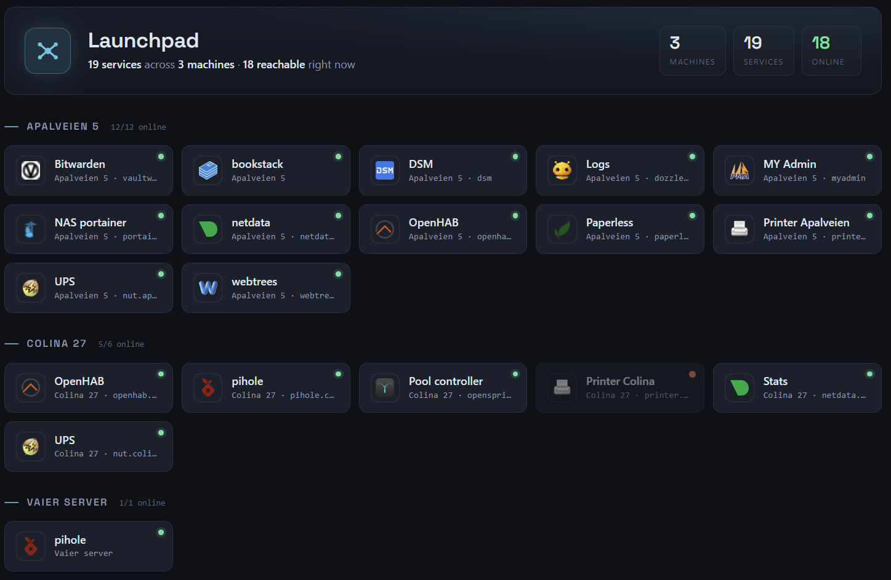
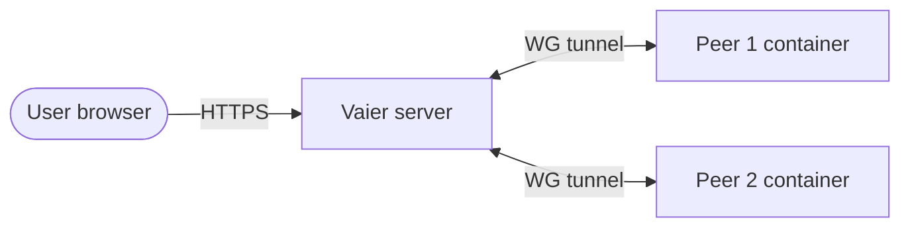

<div align="center">
  
</div>

# Vaier

[](https://github.com/getvaier/vaier/actions/workflows/build-deploy.yml)
[](https://hub.docker.com/r/getvaier/vaier)
[](LICENSE)
[](https://openjdk.org/projects/jdk/21/)

**Vaier** — Norwegian for *wire* (as in cable), pronounced **VY-er** — is the glue for your homelab.

One box on the internet. Your machines at home, behind WireGuard. Every service gets an HTTPS address, a login, and a dashboard tile — nothing to configure by hand: no Traefik files, no WireGuard configs, no DNS record beyond the one wildcard you make on day one.

---

## What it does

| Feature | Description |
|---------|-------------|
| **VPN mesh** | WireGuard peers and LAN servers (NAS, printers, extra Docker hosts) join one mesh, with cross-site routing between relays. See [`docs/NETWORKING.md`](docs/NETWORKING.md). |
| **Reverse proxy & edge hardening** | Traefik terminates HTTPS with Let's Encrypt, enforces a security-header and TLS floor on every route, blocks malicious traffic at the edge with a CrowdSec Security Engine and bouncer — every blocked address listed in the Explorer with where it came from, one click to let it back in or trust it for good — and shows a branded offline page when a backend is down. See [`docs/NETWORKING.md`](docs/NETWORKING.md). |
| **Wildcard DNS** | One `*.yourdomain.com` record, made once, covers the console, sign-in, and every service you ever publish. See [`docs/NETWORKING.md`](docs/NETWORKING.md). |
| **Service publishing & launchpad** | Publish any container in one click; a viewer-adaptive dashboard links to whatever each visitor is allowed to reach. See [`docs/NETWORKING.md`](docs/NETWORKING.md). |
| **Access management** | Google or GitHub sign-in via oauth2-proxy and Dex, with roles (pending → user → admin) and per-service access groups. See [`docs/AUTH.md`](docs/AUTH.md). |
| **Fleet backup & survival kit** | Automated borg backups to one designated backup server, plus a self-updating "survival kit" so your backups stay readable even if Vaier itself is gone. See [`docs/BACKUP.md`](docs/BACKUP.md). |
| **Monitoring & alerts** | Disk-usage watching with a fill-rate forecast — a disk already too full when Vaier starts is mailed about immediately, then again only when it gets five points worse, never on a timer — container image-update detection, and email that stays quiet — routine bans at the edge are listed in the Explorer, never mailed; only a credential attack, or CrowdSec blocking one of your own networks, reaches your inbox. See [`docs/MONITORING.md`](docs/MONITORING.md). |
| **Explorer** | One tree for the whole fleet — browse files, containers and services, select and transfer across machines, step back in time through backup archives, and see live who's blocked at the edge. See [`docs/EXPLORER.md`](docs/EXPLORER.md). |
| **Web terminal** | A real, persistent SSH shell to any machine, opened in its own window and reattached automatically across reconnects and redeploys. See [`docs/EXPLORER.md`](docs/EXPLORER.md). |
| **Host credentials** | One encrypted vault holds the SSH login for every machine; the browser never sees a secret. See [`docs/EXPLORER.md`](docs/EXPLORER.md). |
| **Suggested next steps** | Each machine's pane nudges you toward the next thing worth doing with it, with the evidence shown alongside. See [`docs/EXPLORER.md`](docs/EXPLORER.md). |
| **Fleet-wide polish** | Inline field help, an in-app Concepts glossary, consistent sign-in branding, and device-category icons. See [`docs/EXPLORER.md`](docs/EXPLORER.md). |



---

## How it fits together



Every published service resolves to the single Vaier server through your one `*.yourdomain.com` record, terminates TLS at Traefik, optionally passes social-login authorization (Google or GitHub via oauth2-proxy, then Vaier's own access check), and is proxied over WireGuard to the container running on a peer. More in [`docs/NETWORKING.md`](docs/NETWORKING.md).

---

## Prerequisites

- A Linux server with a public IP (EC2 t3.small or similar)
- Docker and Docker Compose v2.23+ (the compose file embeds an inline `configs:` entry, which requires Compose v2.23 or newer — December 2023). The `curl get.docker.com | sh` step below installs current.
- A domain name you control, hosted anywhere that can serve a wildcard `A` record

### Server ports to open

| Port | Protocol | Purpose |
|------|----------|---------|
| 22 | TCP | SSH |
| 80 | TCP | HTTP (Let's Encrypt challenge) |
| 443 | TCP | HTTPS |
| 51820 | UDP | WireGuard VPN |

---

## Quick start

### 1. Install Docker and rig the machine

```bash
curl -fsSL https://get.docker.com | sh
sudo usermod -aG docker $USER   # then log out and back in
```

Confirm with `docker ps` (no `sudo`). Then fetch the runtime files Vaier needs (the compose file, and the assets it bind-mounts) and scaffold a `.env` — **no git clone**:

```bash
mkdir -p vaier && cd vaier
curl -fsSL https://raw.githubusercontent.com/getvaier/vaier/main/install.sh | bash
```

### 2. Point your domain at it

Make one DNS record, before first boot, at whatever DNS host your domain lives on:

| Record | Type | Value |
|--------|------|-------|
| `*.yourdomain.com` | A | the public IP of this server |

That single wildcard covers the console, the sign-in hosts, and every service you publish from now on — nothing to add, ever, when you publish a service. Vaier checks it for you at every boot and reports the verdict in the boot log and in **Settings**. Caveats and the full mechanics are in [`docs/NETWORKING.md`](docs/NETWORKING.md).

### 3. Configure `.env`

Step 1 already created `.env` with three secrets generated for you. Open it and fill in your own values — **don't recreate the file**, or you'll wipe those secrets:

```ini
VAIER_DOMAIN=yourdomain.com
ACME_EMAIL=you@yourdomain.com
VAIER_OIDC_GOOGLE_CLIENT_ID=...apps.googleusercontent.com
VAIER_OIDC_GOOGLE_CLIENT_SECRET=...
VAIER_ADMIN_EMAIL=you@gmail.com
```

At least one sign-in provider — Google and/or GitHub — is required; the full registration walkthrough (OAuth client setup, redirect URIs, GitHub as an alternative or an addition) is in [`docs/AUTH.md`](docs/AUTH.md). `VAIER_ADMIN_EMAIL` becomes the first admin on first login.

### 4. Start the stack and sign in

```bash
docker compose up -d
```

Once `docker compose ps` shows every service `Up`, open `https://vaier.yourdomain.com` and sign in with your admin account. Anyone else who signs in lands as **pending** until you approve them on the **Users** page.

From here: add your machines and publish their services from the **Explorer** — see [`docs/NETWORKING.md`](docs/NETWORKING.md). For optional environment variables, secret-file hardening, and other advanced topics, see [`docs/ADVANCED.md`](docs/ADVANCED.md).

---

## Roadmap

The backlog is tracked in [GitHub Issues](https://github.com/getvaier/vaier/issues). Feature specs for planned items are in [`PRD.md`](PRD.md).

---

## Contributing

Contributions are welcome. See [`CONTRIBUTING.md`](CONTRIBUTING.md) for the development guide (architecture, TDD rules, build instructions, PR expectations).

---

## Disclaimer

Vaier is a personal homelab tool provided as-is. Use it at your own risk. The authors accept no responsibility for security incidents, data loss, service outages, misconfigured firewalls, exposed services, or any other damage arising from its use. Running this software means exposing infrastructure to the internet — you are responsible for understanding what you are deploying.

The Apache License 2.0 (below) contains the full warranty disclaimer and limitation of liability in sections 7 and 8.

## License

Apache License 2.0 — see [LICENSE](LICENSE).

## Attribution

IP geolocation on the Explorer's map is provided by [DB-IP](https://db-ip.com), licensed under [CC BY 4.0](https://creativecommons.org/licenses/by/4.0/). The `geoip-init` container downloads the latest DB-IP City Lite database to a local volume on first boot and refreshes it monthly.

---

*Built for the self-hosted community.*
