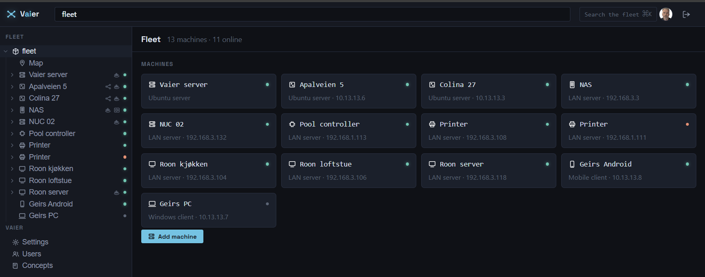
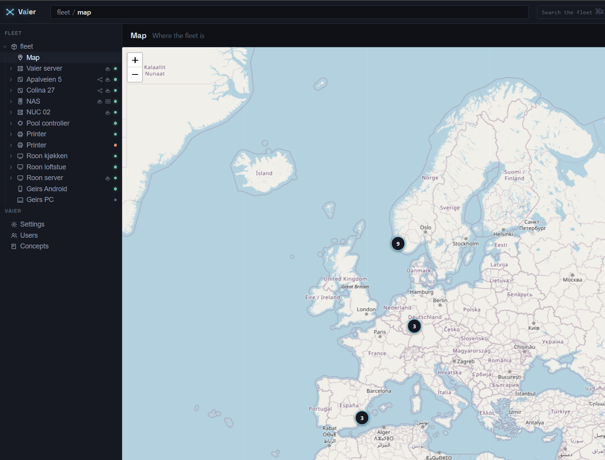

# Explorer

Back to [README](../README.md).

One tree spanning the whole fleet, at `/explorer.html` — the shape Vaier's UI is becoming. This covers the tree itself, the web terminal, the credential vault behind it, and the smaller pieces of UI polish that live alongside it.

---

## Suggested next steps

Once a machine is on the mesh, its pane in the Explorer surfaces evidence-backed suggestions for the next thing worth doing with it — publish the services it exposes, back it up, or (before any exists) make it the fleet's backup server. Each is a single action with its reason shown ("reachable, Vaier holds a credential, nothing backed up yet"), and appears only when it actually applies — Vaier works out which, so you decide the intent, not the mechanism.

---

## The tree

Every machine is an **entry** you can open, and it grows only the entries Vaier can actually reach on it: **files** when Vaier has SSH to it, **containers** when it runs Docker, **services** when something is published from it, its **disk** when Vaier has SSH, and a **backup** entry on the one machine that is the fleet's backup server — so a machine with no SSH doesn't sprout files it can't read, and a machine running no Docker doesn't sprout an empty container list. A machine's **shell** is not a tree entry — its **SSH access** section carries an **Open shell** button that opens the terminal in its own window (see [Web terminal](#web-terminal) below).

The **path** you're standing on is the address bar, the **Inspector** on the right renders whatever you select (a machine shows its details, a directory shows its listing, a container shows what Vaier knows about it, a published service shows its route), and **⌘K** searches every entry in the fleet by path — including containers and published services, since they're entries in the same namespace now.

Each machine row also carries small **capability glyphs** just before its status dot — a relay mark when it's a relay peer routing a LAN behind it, a Docker mark when it runs Docker, and a safe when it's the fleet's backup server — so the fleet's shape reads at a glance: how a machine is reached, what it runs, what it keeps. The **status dot** beside a machine reports what Vaier actually knows: green when a peer's tunnel is up or a LAN machine answers its probe, amber when a machine is on the network but its Docker scrape is failing, red when it's unreachable, and grey only when nothing has probed it yet — grey means "no answer yet", never "fine".

A machine's **backup** entry carries a dot of its own, coloured by that machine's last backup run (red for a failed *or* incomplete one, amber for a warning, green when it got everything, grey when it has never run), so a backup that went wrong is visible from the tree instead of only to whoever thinks to open that machine. And where a run failed for the one reason a single action fixes — the machine has no borg client yet — the entry offers **Get this machine ready** and does the install itself; where Vaier can't become root there, it leaves the one `sudo bash …` command on screen for you to run in that machine's shell.

Infrastructure has moved into the tree wholesale — adding a machine, scanning a LAN, the world map (a **Map** entry at the fleet root), storing SSH credentials, running setup scripts, editing allowed groups, and publishing a discovered container are all native entries now, and the old Infrastructure page is gone. The sections not yet part of the tree — **Users**, **Concepts** — still appear as entries that open today's page unchanged (**Settings** and **Backups** are native now — the standalone Backups page is gone), and the **admin console** (`/admin.html`) survives only as a redirect for old links until those last sections move across.

### Files and the SFTP root

**Directories expand in the rail**, read one at a time over SFTP as you open them — never eagerly, because the fleet is behind a VPN and a tree that walks it all at once is a tree that hangs. The **rail** carries the structure, so only directories become rows in it; the Inspector lists what's actually inside (files and directories both). A directory is read once and remembered, so folding it away and opening it again costs nothing, and one that can't be read says so on the spot, in the server's own words ("Not allowed to read /root as geir.") — it never pretends to be empty, and that holds right down to a machine whose SSH server has no **SFTP subsystem** at all (DietPi's Dropbear ships without one), which is named along with the way out: install `openssh-sftp-server` on it, or switch it to OpenSSH.

Vaier reads a machine's filesystem over SFTP, authenticating server-side from the **credential vault** and trusting the host key by the same trust-on-first-use pin as the web terminal, so browsing a machine needs no new credentials and no new trust. When there *is* no stored credential for a machine, the browse says exactly that and names the machine so you can add one ("No SSH credential is stored for … — add one to browse its files"), rather than looking like an empty folder; and a credential the host rejects reads as a "check the credential" failure, never a generic error.

Every file is shown at the **machine's own path** — the one you'd see in a shell, in `df`, or in a backup job's source paths — even when the machine disagrees with itself: a NAS that chroots its SFTP service into `/volume1` while its terminal sees the real root has one directory under two names, so Vaier learns where each machine's **SFTP root** is — by asking both channels where the SSH user's home is, and taking the difference — and maps between them, showing you `/volume1/homes/geir` and never the jail's `/homes/geir`. (A machine that won't say where its SFTP service is rooted gets *found* instead: Vaier asks its SFTP side which of the home's possible names it can actually see. The machine's own name for the home is always tried first, so an ordinary machine matches straight away and is never given a jail it doesn't have.)

A machine's tree therefore begins at its SFTP root, not at `/`, and a path above it (`/volume2` on that NAS) says exactly that — it is never shown as an empty folder. A machine Vaier can't ask is simply left alone: unknown is safe, guessing isn't. Directories list before files, and a path that isn't absolute — or that tries to climb above the root — is refused before Vaier opens any connection.

### Containers and published services

A machine's **containers** are the ones Vaier's Docker scrape returns for it (every container with at least one exposed port, running or stopped), and opening one shows its image, version, state, ports, networks and container id — **read-only, deliberately**: Vaier has no way to start, stop or restart a container or fetch its logs, so it offers no button that would only pretend to (use the machine's shell for that).

A machine's **published services** show that a service is one thing with two homes — a container on the machine and a route through Traefik: opening one shows its route state, the backend it points at, its path prefix, the image and version behind it, its **auth mode** and its **allowed groups** — all editable in place, alongside its launchpad display name and visibility and an **Advanced** fold (root redirect, version endpoint, direct-LAN-URL) — and offers **Unpublish** (after a confirmation), which takes down the route while leaving the container running. Publishing a *new* service also happens here: a machine's discovered-but-unpublished containers appear as **+ Publish** rows, and a relay-anchored LAN server offers a by-hand **Publish LAN port** form, each with its own **Advanced** fold. See [`docs/NETWORKING.md`](NETWORKING.md) for the publishing flow and auth details.

### Disk

A machine's **disk** is read when you look at it — `df` over the same SSH connection everything else uses — and lists **every** filesystem on it, not just the root one: each with its mount point, device, size and free space, a usage meter, and the threshold tick it's judged against, with the same verdict the alert email is sent from. Kernel and in-memory mounts, and the bind-mount aliases a Docker storage driver leaves behind, are left out — they're not disks, and one volume wearing eight masks would raise eight alerts.

Each filesystem carries its own **watch**: mute the ones that are full by design (a NAS system partition sits at 88% forever) or give one a threshold of its own, right there in the pane — a muted filesystem keeps its meter but loses its tick, because nothing is being judged. Anything you haven't muted is watched, so a new volume nags rather than hides. A disk Vaier can't read (an asleep machine, an SSH user that can't run `df`) says exactly that, and is never painted as an empty disk. See [`docs/MONITORING.md`](MONITORING.md) for thresholds, the fleet-wide default, and the fill forecast.

### The backup server's own entry

You **designate the fleet's one backup server** from a machine's own view — a **Make this the fleet's backup server** action shown while none is designated yet, its form prefilled from the machine's address — and the machine that plays the role then grows a **backup** entry: its Inspector shows that server's coordinates (name, where Vaier reaches its `borg serve`, borg user, base repo path, data path, and whether Vaier stood it up or adopted it) and the **backup repositories** on it — each a navigable entry of its own — with a **New repository** action, **Edit coordinates** and **Remove designation** for the server itself, and a **Server operations** section — **Provision**, **Authorize a host**, and **Download setup script** — for readying the server and its clients (the provision dialog settles itself off the `provision-settled` event, never polling).

The server's entry reads **Backups kept here**, listed by the machine whose backups they are — you never meet the word "repository", never name one and never make one, because Vaier creates exactly one per machine behind the **Back up** verb and generates its passphrase. Opening one shows the **archives** inside it (read when you open it); its path, append-only flag and passphrase fold away under **Storage details**, alongside **Edit** and **Forget these backups** — which forgets them in Vaier without erasing the borg store or a single archive. A store no machine backs up to any more says exactly that, rather than sitting in the list looking like a machine. There is no create-by-hand control and no separate Backups page. See [`docs/BACKUP.md`](BACKUP.md) for the full backup-server and repository story.

### Selection, transfers and viewing files

Service and container liveness arrives over the existing published-services event stream, so the page never polls.

**Tick files to build a Selection** that survives every navigation — across folders and across machines — shown in a fleet-wide selection bar (`N selected · M machines`) whose verbs fan out per machine.

A **viewable** file — an image, a PDF, a text, log or config file, a video — **opens in a new tab** straight from its name in the listing, in the present or in an archive; anything else stays download-only, including markup a browser could run script from (an HTML page, an SVG), which Vaier will not display.

You can **download** any file to your browser — a single file streams as itself and a single folder as a zip of its whole tree, while **two or more selected items come down as one `application/zip`** built server-side across every machine and archive in the selection — and **copy a file or folder from one machine to another** — a **Transfer**. Because Vaier sits at the VPN hub and is the only node with SSH to every machine, a cross-machine copy is a read from the source streamed straight through Vaier's own process to a write on the destination: no host ever needs SSH to another, and nothing is buffered whole, however large the file. A Transfer runs in the background and reports its progress live as the bytes move, and it settles as done or failed on the same event stream the page already listens on — it never polls.

**You can only paste into the present**: a copy's destination is always the live machine, though its *source* may be a point in the past (an **archive**), which is how a restore works — pasting an archived file back onto its own live path.

You can also **delete** a file or folder from a machine's live filesystem — a folder goes with everything inside it — behind a typed machine-name confirmation, because a delete is destructive and cannot be undone. Deleting is **present-only**: there's no deleting the past, since an archive is read-only by construction, and a machine's whole browsable tree (its **SFTP root**) can never be deleted at all. Renaming and creating folders land in a later slice.

### Browsing the past (the time rail)

A machine that has backups grows a **time rail** — a row of stops, one per backup **archive**, newest nearest **Now** — and clicking a stop shows that machine's files *as they were* in that archive. Vaier mounts the archive as a read-only filesystem on the machine (via `borg mount`) and lists the very same directory inside it, so a file keeps one **path** across both the present and the past.

Scrub back and the whole view crossfades to an amber "past" palette, the liveness dots go dark, and a line tells you the archive's time and how long ago it was; click **Now** to return to the live filesystem. The past is read-only by construction (the mount is `ro`, so you can only ever paste into the present), and idle mounts are swept off the fleet automatically — including one a restart or a stuck unmount left behind, which would otherwise hold the repository's lock and quietly block that machine's scheduled backups.

A machine's archives are read once when you first open its files — never on a timer — and a machine with no backup job simply grows no rail. On one Vaier *does* back up, the rail takes its room from the first paint and its stops fill in when the list lands, so the listing never jumps down while you're reading it.

### Marking what matters (backing up from the file view)

**Mark what matters and Vaier backs it up**: tick any files or folders — the same fleet-wide **Selection** — and click **Back up**, and Vaier does the rest for each machine in the selection: it gets-or-creates that machine's **backup repository** (with a strong, backend-generated passphrase you never have to type) and its **backup job**, and folds your selection into the job's paths, keeping them minimal so picking a folder quietly absorbs anything you'd already picked beneath it.

On a machine's **first** back-up — the one that creates its job — Vaier also prepares the host for you: it trusts the machine's key on the backup server and installs the borg client (the same **Prepare client** work the wizard does), so a machine goes from unprovisioned to backed up without a manual wizard step. This runs only on that first back-up (adding paths to a machine that already has a job never re-does it), and a preparation that can't complete never fails the back-up — the paths are still saved and the reason is reported.

Every entry then wears a **shield**: a full shield when it's **backed up** (it, or an ancestor, is in a job), a half shield when it merely *contains* something backed up further down — so the coverage gap a summary list would hide (a job that protects `/home/geir` while every Docker volume goes unprotected) is obvious while you're standing in the folder. **Stop backing up** really stops it, whichever way you picked it: a path the job names outright goes (with everything beneath it), while a folder that merely sits *inside* a protected path can't be dropped without losing its siblings — so Vaier records it as an **excluded path** on the job instead, borg walks past it, and its shield disappears. Back the same folder up again and the exclusion is cleared with it, so a folder is never protected on screen and quietly skipped in fact.

Vaier tells you what actually happened rather than what you clicked: pick something nothing was backing up and it says *"Nothing changed — Vaier was not backing that up."* Clearing a machine's last path deletes its job while leaving the repository intact. Shields show only in the present — an archived past listing wears none — and **Back up** appears only while the fleet actually has a backup server: with none designated there is nowhere for an archive to go, so rather than offering the verb and then refusing it, Vaier doesn't offer it until you've said which machine holds the fleet's data (its own nudge asks). That decision is the only one in this flow Vaier can't make for you — the repository, the job, the schedule, the borg install and the key trust all happen behind the one click.

---

## Web terminal

Open a real SSH shell to any SSH-capable machine — VPN peers, LAN servers, and the **Vaier server** host itself — from its **SSH access** section in the Explorer: an **Open shell** button beside the machine's SSH credential opens the shell in its **own browser window** — a full-window, resizable terminal you can place anywhere and keep several of at once on a wide screen, in a minimal popup without the browser's tab strip or address bar. There is **no terminal dock in the Explorer**: one machine, one window, opened straight from that machine's page.

**Open shell** always returns to the machine's one **primary shell** — reattached every time so reopening never loses your place, and one window per machine means re-opening focuses the window already there rather than spawning a second — while **Duplicate** deliberately opens a *fresh*, separate shell in its own window when you want more than one shell on a machine at once. Reattaching is deterministic: the primary shell returns to the same session by a stable id it remembers, never by scavenging whatever orphaned session happened to be lying around.

On a phone it's a single full-screen shell at a smaller font, with touch-scroll that stays inside the terminal, and — for as long as any shell is open — Vaier **holds the screen awake** (via the browser's Screen Wake Lock) so a command you're watching doesn't vanish behind a dimmed display, releasing it the moment you close the last shell. An on-screen **key bar** appears above it carrying the keys a soft keyboard can't reach — **Esc**, **Tab**, the four **arrow** keys (which navigate correctly in vim/less), and **Ctrl**/**Alt** as *sticky* modifiers you tap to arm (it glows) so the very next key — tapped on the bar or typed on the keyboard — is modified, e.g. arm Ctrl then type `c` for Ctrl-C.

The remote PTY reflows to fit the window, and a dropped connection **reconnects automatically** (with backoff) so a tunnel blip or a host reboot heals itself. Each shell runs inside a tmux session on the machine (a **persistent shell**), so closing the window leaves the shell running — it even survives Vaier itself being redeployed — and reopening **reattaches** to the same shell with your cwd, history, and scrollback intact, and the banner tells you the truth ("reattached — session resumed", or a new shell if the old one was genuinely lost). On a machine without tmux installed it opens a plain shell instead, so a terminal never fails to open.

Because a persistent shell is built to survive a lost connection, only **Exit shell** (inside the window) stops one for good — the tmux session on the machine ends, and so does whatever was still running inside it — while everything else (closing the window, a tunnel blip, a closed laptop, a Vaier redeploy) merely **disconnects** and leaves the shell running on the machine to reattach to. Closing the window is a disconnect, not an end: reopening the machine's shell reattaches you right where you left off.

Vaier authenticates server-side from the **credential vault** (the browser never sees the secret) and pins each host's key on first use, refusing a later mismatch. When a shell prompts you for a password or key passphrase — a `sudo`, an `ssh` to a further hop — a **Send password** action writes the machine's stored password straight from Vaier into the remote shell, without the browser ever seeing it; Vaier watches the shell output server-side so the action is usable only while the remote is actually at a prompt, and re-checks before sending so it can't echo into the screen or your shell history. When the shell exits, its window closes on its own rather than leaving a dead terminal to tidy. Distinct, legible failures when there's no credential, the host is unreachable, auth fails, or the host key changed.

**Open shell** (and the **SSH access** checkbox, and the Explorer's Files/Disk entries) grey out — never disappear — the moment Vaier's own periodic disk sweep finds nothing listening on a machine's SSH port at all, so a dead end shows before you click rather than after; the greying lifts on its own the next time a sweep reaches the machine again, no reload needed. An already-enabled **SSH access** toggle is never itself disabled, so you can always turn it back off or open its credential. Powered by a local xterm.js over a WebSocket and Apache MINA sshd.

### Copy, paste and scroll inside a shell

A click-drag selects text and Ctrl/Cmd+C copies it to your clipboard, the same as any terminal. A full-screen program (vim, htop, `less`, and interactive CLIs like Claude Code) can ask the terminal for its own mouse events so it can drive its own scrolling — when one has, hold **Shift** while you click-drag to force a normal text selection instead of handing the drag to that program. Ctrl/Cmd+V pastes normally either way.

Plain mouse-wheel scroll goes to whichever program is in front: a normal shell prompt scrolls the terminal's own history, while a full-screen program that has grabbed the mouse scrolls its own view instead — there is nothing to scroll if that program hasn't asked for mouse events at all, since a full-screen redraw mode has no scrollback of its own by definition (the same as in any terminal emulator — you can't scroll back inside `vim` or `htop` either). **Shift+PageUp / Shift+PageDown** always scrolls the terminal's own local buffer directly, regardless of what's running remotely — the one shortcut guaranteed to work everywhere.

---

## Host credentials

Store the one SSH login Vaier holds for each machine — a username plus a password or private key (with optional passphrase) — from the machine's pane in the Explorer. Every machine — including the **Vaier server** host itself — has an **SSH access** toggle that decides whether Vaier offers SSH for that machine; it defaults sensibly from the device type (servers and NAS on, printers/phones/appliances off) and the credential and **Open shell** controls only appear when SSH access is on. Turning SSH access off hides that machine's files and disk entries and its **Open shell** button. Secrets are encrypted at rest in a **credential vault**; the UI only ever reports whether a credential exists, never the secret itself.

---

## Device category

Each machine carries a **device category** (phone, laptop, desktop, server, NAS, printer, router, gateway, IoT, camera, media, or generic) that decides which icon it shows — independent of its VPN role. Vaier auto-detects it from the machine's name (e.g. "synology-nas" → NAS), any LAN-scan hint, and its peer type, falling back to a generic icon. You can pin an explicit category to override the guess, and clear it to fall back to auto-detection; renaming a machine re-detects when no override is set. The device category is presentation only — it never affects how Vaier routes or keys a machine.

---

## Polish

**Inline field help** — Advanced fields (LAN CIDR, path prefix, root redirect, the auth toggle, direct LAN URL, hide-from-launchpad, version endpoint) carry a small "?" you can hover for a one-line plain-language explanation — no need to read the docs to know what a field does.

**Concepts page** — An in-app **Concepts** glossary in the admin shell explaining, in plain language, every term you meet in the UI — grouped by area, each with a short definition and a one-line "why it matters". Each entry is deep-linkable via its anchor (e.g. `concepts.html#lan-cidr`).

**Consistent branding** — The oauth2-proxy sign-in and error pages — and the Dex broker's own screens — all share Vaier's dark theme, so the sign-in hand-off (Google or GitHub) feels seamless end to end.

**Version visibility** — The running Vaier version is shown under *Settings → About*, so you always know which build is deployed.
